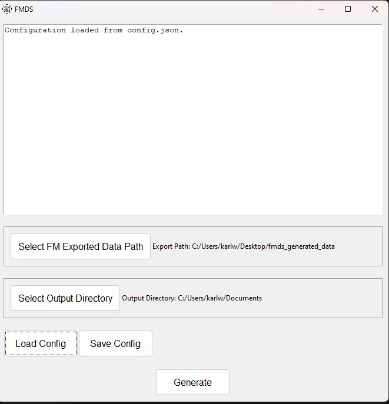
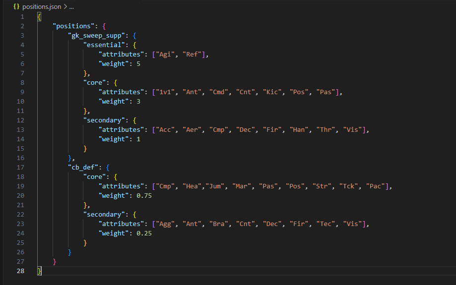

# Football Manager Data Science (FMDS)


FMDS is a Python script designed for Football Manager data analysis and reporting. This script processes exported data from Football Manager, calculates player attributes based on predefined weights, and generates interactive HTML reports using DataTables integration.

First thing first, Thanks to [squirrel_plays](https://www.youtube.com/@squirrel_plays_fof4318) for the Inspiration and their hard work on the football manager views, Their code is under `./original.py`.

## Prerequisites
- Windows 11 (May work on 10 & 7)

## Install
- [Download the latest zip from Github](https://github.com/ktasper/FMDS/releases)
- Extract the zip to a new folder, I do `Documents/FMDS`
- Run the `exe`
- Or `python main.py` if doing it via the source code.

## Usage
1. Export Data from Football Manager
- Export squad data from Football Manager and save it to a folder.
    - I use the `all_attribute_squad` for my squad view.
    - Select all players with shift click
    - `CTRL + P` > Web Page
    - Save this file where-ever you want, I have a folder on my Desktop called `Documents/FMDS-Data` so its easy to do in the FM UI.
        - Don't forget to give it a name you understand.
- Edit the `config.json` with your path to your FMDS-Data folder.

3. Define Position Weights (Optional)
- Customize player attribute weights for different positions by editing the positions.json file. Follow the specified format to define scoring categories such as "essential," "core," and "secondary."
    - You can add as many or as little categories as you want.

Supported names are:
```
[
    "Reg", "Inf", "Name", "Age", "Wage", "Transfer Value", "Nat", "2nd Nat",
    "Position", "Personality", "Media Handling", "Av Rat", "Left Foot", "Right Foot",
    "Height", "1v1", "Acc", "Aer", "Agg", "Agi", "Ant", "Bal", "Bra", "Cmd", "Cnt",
    "Cmp", "Cro", "Dec", "Det", "Dri", "Fin", "Fir", "Fla", "Han", "Hea", "Jum", "Kic",
    "Ldr", "Lon", "Mar", "OtB", "Pac", "Pas", "Pos", "Ref", "Sta", "Str", "Tck", "Tea",
    "Tec", "Thr", "TRO", "Vis", "Wor", "UID", "Cor", "Club"
]
```

We also create a few custom metrics:
```
"Spd" = "Pac" + "Acc" / 2
"Work" ="Wor" + "Sta" / 2
"SetP" ="Jum" + "Bra" / 2
```


4. Run the Script
- Execute the fm_data_science.py script.
- Run the `fmds.exe`
    - or `python main.py`


The program will ask you for the following:

- `FM Export Path` - This is where you saved the exported views (IE player / Team stats) via the views under `fm_files`
- `Output Dir` - This is where the generated reports go.
- `Save / Load Config` - Lets you save or load the above settings so you do need to set them each time (NOTE: you need to press load to load the settings.)

5. Generated HTML Report
- The script generates an HTML report (output.html) with DataTables integration. Open this file in a web browser to view the interactive report. The file gets saved to the `generated_data` folder


## Customization

### Modifying Position Weights

Customize player attribute weights for different positions by editing the positions.json file. Update the attributes and weights based on your game preferences.

[The position short code and what they mean can be found here](https://github.com/ktasper/FMDS/wiki/Attribute-Meanings)



## Notes
The script only works on the latest file in the `fm_export_path`.
